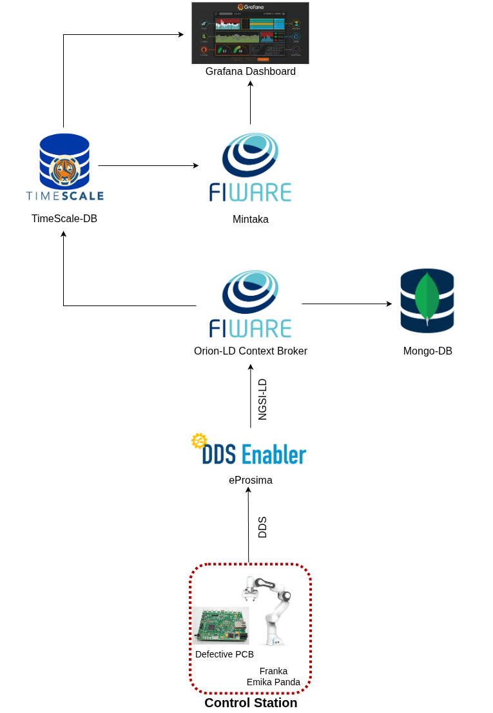

#### Fiware temporal operation architecture

<p align="center">
  </a>
</p>

### Run containers
1 - Build the docker compose file
 ```bash
sudo docker compose build
```
2 - Run the docker services
 ```bash
sudo docker compose up
```
#### Run ROS2 pakcages
3 - In case you need source the workspaces
```bash
sudo docker exec -it pcbinfo bash
source /opt/vulcanexus/jazzy/setup.bash
source /control_station_ws/install/setup.bash
```

4 - In a new terminal, run the server where pcb images are uploaded

```bash
sudo docker exec -it pcbinfo bash
python3 -m uvicorn pcb_img_server.run_server:app --host 0.0.0.0 --port 5000
```


5- In a new termianl, launch the following for pcb images to get generated and sent to the server  

```bash
sudo docker exec -it pcbinfo bash
ros2 launch defective_pcb_detector defective_pcb_generator.launch.py
```

##### Grafana Dashboard settings

9 - Open your web browser and navigate to `http://localhost:443/`. The default username/password are both `admin`. 
Once logged in, click on **dashboards** on the left menu and select the **pcb_metadata_readable** dashboard.

In case you want to design your panel, you can finde the queries on the data sources as bellow
```bash
SELECT
  ts AS "time",
  compound->>'id' AS pcb_id,
  compound->>'url' AS image_url,
  (compound->>'width')::int AS width,
  (compound->>'height')::int AS height,
  (compound->>'defected')::boolean AS defected,
  (compound->>'defect_loc_x')::float AS x,
  (compound->>'defect_loc_y')::float AS y,
  compound->>'material_info' AS material_info,
  (compound->>'heatsink_number')::int AS heatsink_size,
  compound->>'departured' AS departured
FROM
  attributes
WHERE
  entityId = 'urn:ngsi-ld:pcb:1'
  AND id = 'https://uri.etsi.org/ngsi-ld/default-context/mypcb'
ORDER BY
  ts DESC
LIMIT 1;

```
In our case, Business Text plugin has been chosen as our visualization plugin, and the html code for rendering of json info is:
```bash
      <h2>Defective PCB Info</h2>
      <p><strong>ID:</strong> {{@root.pcb_id}}</p>
      <p><strong>Defected:</strong> {{@root.defected}}</p>
      <p><strong>Material:</strong> {{@root.material_info}}</p>
      <p><strong>Defect Location:</strong> ({{@root.x}}, {{@root.y}})</p>
      <p><strong>Departured:</strong> {{@root.departured}}</p>

      <figure style="text-align: center;">
        
        <figcaption style="font-size: 14px; color: #666; margin-top: 8px;">
          Defective PCB detected on {{@root.departured}}
        </figcaption>
      </figure>
```

<p align="center">
  </a>
</p>