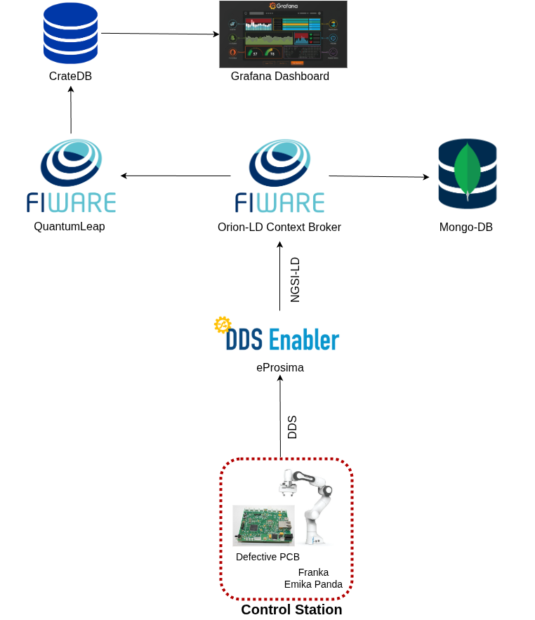
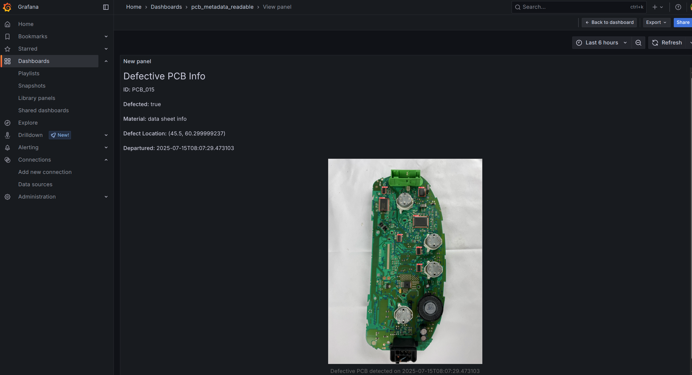

## Introduction
This repositroy is part of the development of a robotic application as one of usecases of the EU-funded project, <a href="https://arise-middleware.eu/">ARISE: all-in-one-middleware</a>, which has been developed at the <a href="https://www.industry40lab.org/">INDUSTRY4.0</a>  contributing as a TEF in the project. 

In a nutshell, it is demonstrated that messages in  the DDS format are translated into the NGSI-LD format and can be displayed on the dashboard,i.e., the interoperability between NGSI-LD and DDS protocols. 

### Eprosima FastDDS
Eprosima FastDDS is the implementation of DDS (Data Distribution Service) standard. FastDDS is the default middleware of ROS2 framework for data communication. As part of ARISE-all-in-one-middleware toolset, Eprosima developed the [DDS Enabler](https://github.com/eProsima/DDS-Enabler) which maps DDS messages into the NGSI-LD format.  
### FIWARE stack 

In context-driven systems, it is important to track how data changes over time. Withing the FIWARE stack, there are two approaches to track data:

i) Activating temporal interface, which lets you automatically store and query historical data. (using components such as FIWARE Mintaka and Timeseries-DB, CrateDB). The advantage of the temporal interface is that it is provided by the context broker directly - no subscriptions are needed and HTTP traffic is reduced. Furthermore, the temporal interface can be queried across all context entities, not merely those which satisfy a subscription.

ii) Subscribing to individual context entities and persisting them into a time-series database (using components such as FIWARE QuantumLeap, CrateDB); The advantage of using a subscription mechanism is that only the subscribed entities are persisted, saving disk space. 

For a more comprehensive understanding, check these two links: 

1 - [Turorial on temporal operation from FIWARE](https://ngsi-ld-tutorials.readthedocs.io/en/latest/short-term-history.html)

2 - [Orion-ld Temporal Representation of Entities (TRoE),](https://github.com/FIWARE/context.Orion-LD/blob/develop/doc/manuals-ld/troe.md)
<p align="center">
  </a>
</p>

## Showcases
i) For the subscription check the branch [develop_branch_v1](https://github.com/mosmz95/ariseproject/tree/develop_branch_v1)

ii) For the termporal interface check the branch [develop_branch_v2](https://github.com/mosmz95/ariseproject/tree/develop_branch_v2)
### Run containers
1 - Build the docker compose file
 ```bash
sudo docker compose build
```
2 - Run the docker services
 ```bash
sudo docker compose up
```
#### Run ROS2 pakcages
3 - In case you need source the workspaces
```bash
sudo docker exec -it pcbinfo bash
source /opt/vulcanexus/jazzy/setup.bash
source /control_station_ws/install/setup.bash
```

4 - In a new terminal, run the server where pcb images are uploaded

```bash
sudo docker exec -it pcbinfo bash
python3 -m uvicorn pcb_img_server.run_server:app --host 0.0.0.0 --port 5000
```


5- In a new termianl, launch the following for pcb images to get generated and sent to the server  

```bash
sudo docker exec -it pcbinfo bash
ros2 launch defective_pcb_detector defective_pcb_generator.launch.py
```


##### Subscription of Quantumleap to the Broker
6 - Create the subscription of quantumleap to the Orion-ld,
the endpoint should be the one which is reachable within 'mynet' network, you can run this python script 
```bash
python3 ./configs/contextbroker/QL_subscription_request.py
```
or the following command on the terminal.

```bash
curl --location 'http://localhost:1026/ngsi-ld/v1/subscriptions/' \
--header 'Content-Type: application/json' \
--data '{
  "description": "Monitor changes to the image URL of PCB",
  "type": "Subscription",
  "entities": [
    {
      "type": "Robot",
      "id": "urn:ngsi-ld:pcb:1"
    }
  ],
  "watchedAttributes": ["mypcb"],
  "notification": {
    "attributes": ["mypcb"],
    "endpoint": {
      "uri": "http://quantumleap:8668/v2/notify",
      "accept": "application/json"
    }
  }
}'
```


7 - Check the subscription (if needed)
```bash
curl --location 'http://localhost:8668/v2/entities/urn:ngsi-ld:pcb:1/attrs/mypcb?lastN=3' \
--header 'Accept: application/json'
```

8 - Check the list of subscriptions to the CB (if needed) 
```bash
python3 ./configs/contextbroker/Orion_ld_list_of_subscriptions.py
```
or 
```bash
curl --location 'http://localhost:1026/ngsi-ld/v1/subscriptions/' \
--header 'Content-Type: application/json'

```

##### Grafana Dashboard settings

9 - Open your web browser and navigate to `http://localhost:443/`. The default username/password are both `admin`. 
Once logged in, click on **dashboards** on the left menu and select the **pcb_metadata_readable** dashboard.

In case you want to design your panel, you can finde the queries on the data sources as bellow
```bash
SELECT 
  mypcb['defected'] AS defected,
  mypcb['material_info'] AS material_info,
  mypcb['heatsink_number'] AS heatsink_size,
  mypcb['url'] AS image_url,
  mypcb['id'] AS pcb_id,
  mypcb['defect_loc_x'] AS x,
  mypcb['defect_loc_y'] AS y,
  mypcb['departured'] AS departured
FROM "doc"."etrobot"
WHERE mypcb['url'] IS NOT NULL
ORDER BY time_index DESC
LIMIT 1;
```
In our case, Business Text plugin has been chosen as our visualization plugin, and the html code for rendering of json info is:
```bash
      <h2>Defective PCB Info</h2>
      <p><strong>ID:</strong> {{@root.pcb_id}}</p>
      <p><strong>Defected:</strong> {{@root.defected}}</p>
      <p><strong>Material:</strong> {{@root.material_info}}</p>
      <p><strong>Defect Location:</strong> ({{@root.x}}, {{@root.y}})</p>
      <p><strong>Departured:</strong> {{@root.departured}}</p>

      <figure style="text-align: center;">
        
        <figcaption style="font-size: 14px; color: #666; margin-top: 8px;">
          Defective PCB detected on {{@root.departured}}
        </figcaption>
      </figure>
```

<p align="center">
  </a>
</p>